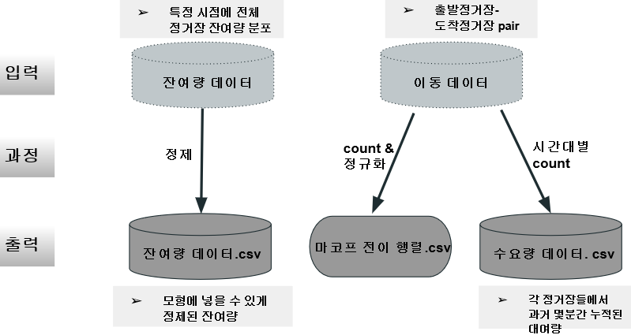
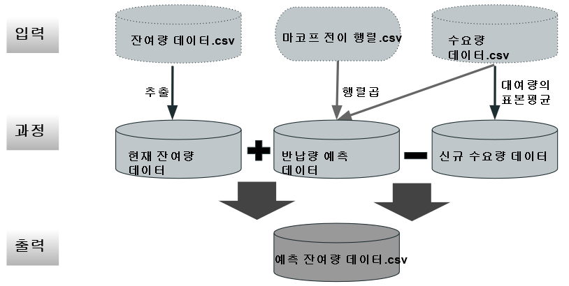
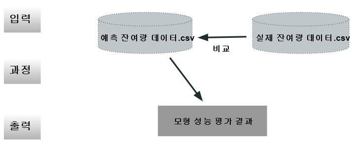

# sumamry
공개SW개발자대회_빅데이터부문_마코프체인을 활용한 따릉이 품절예측모형

2019년 3월에 시작한 프로젝트로써 2019년 11월까지 서울시 오픈소스를 활용해서 개발 함

## How to run
project_graduate로 접근 후 integrate_code.R 을 실행함

## More Information
서울시 따릉이 공공데이터를 마코프 이론을 적용하여 따릉이의 품절을 예측하는 모델을 만들었다.
과거에는 품절이 이미 발생한 후 나 한 정류장의 수요 상황만 고려하여 재배치하였다. 이로 인해 시민들이 따릉이를 이용하지 못하는 경우가 종종 발
생했다. 이러한 문제점을 해결하기 위해 품절이 발생하기 전 마코프 체인이론을 적용하여 모든 정류장의 이동 흐름을 확률화하여 품절을 예측하는 네
트워크식 품절 예측 모델을 만들었다. 우리가 개발한 마코프 체인이 적용한 따릉이 품절 예측 모델이 따릉이를 이용하는 시민들이 품절로 인한 불편함
을 줄일 뿐만 아니라 증가하는 공유 모빌리티 시장에도 적용되어 고객 서비스를 높일 것으로 기대한다.

## Data Mining process 

마코프 체인을 적용한 따릉이 품절 예측 모델 에는 따릉이 정류소의 잔여량데이터와 이동데이터가 쓰였다. 잔여량 데이터는 따릉이 정류소의 실시간 
잔여량을 자바를 이용해 저장하여 구했고 이동데이터는 시울시 공공데이터 사이트에서 구할 수 있었다. 초기상태의 데이터는 정제 되지 않은 raw데
이터 였기 때문에 불필요한 문자나 구두점 등을 제거하고 필요한 데이터들만 통합하는 과정을 수행하였다. 잔여량 데이터를 반납량 데이터와 신규 대
여량 데이터으로 나눠서 모형을 각각 수립하였다. 이동 데이터로는 마코프체인과 통계를 이용한 연구모델의 개념을 정립했다. 또한 시간을 30분 단위
로 나누어 이동 데이터로부터 30분 간격의 평균 수요량 데이터를 구했다. 

현재 잔여량 데이터에 마코프 전이행렬과 수요량데이터의 곱으로 구한 반납량 예측 데이터를 더하고 수요량 데이터로부터 구한 신규 수요량 데이터를 
빼서 예측 잔여량 데이터를 구했다.

수립한 연구모델의 예측결과거 유의미한 지 검증하기 위하여 실제 잔여량 데이터와 예측 잔여량 데이터를 오차를 비교하는 검증과정을 거쳤다.

## Author
* [홍익대학교 산업공학과 김태훈]
* [홍익대학교 산업공학과 우주윤]
* [홍익대학교 산업공학과 박하영]
* [홍익대학교 산업공학과 김영동]

